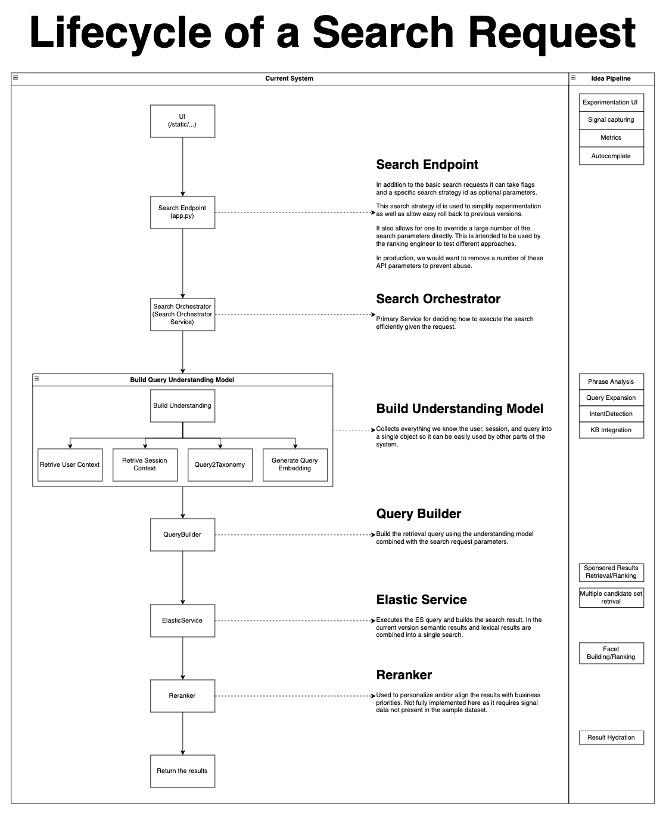

## Overview
This is a sample search application written with goal of improving my python/asyncio skillset as well as my portfolio. This will also give me a future search platform to experiment with. 

I have used asyncio throughout, primarly as a way for me to learn it. As this is written to run on a single machine there is little benfit to running the code asyncrionisly. However, if this was a production application it's likely that this would be split into multiple microservices. 

Python is not my primary language and I am new to asyncio. If one happens to see something suspect and has time to comment, it would be appriciated. 

#### Dataset:
 https://www.kaggle.com/datasets/lokeshparab/amazon-products-dataset

## Setup
### Starting main application
1. Install libraries in requirments.txt
1. run ```docker compose up```
1. run ```python src/main.py``` 

### Index the data
1. Start the applicaton (see above)
1. Go to the ```Managment``` Tab
1. Press the ```Index``` button, monitor log
1. Once indexing is complete press the  ```Update Embeddings``` button, monitor log


## Usage
### Performing a search
```
curl 'http://localhost:5000/api/search' \
  -H 'Content-Type: application/json' \
  --data-raw '{
        "query":"sample query",
        "facets":{},
        "main_category":null,
        "sub_category":null,
        "number_of_results":10,
        "start_index":0,
        "predict_taxonomy":false,
        "vector_search":false,
        "re_rank":false}'
```


## Tools
### BuildModelQueryToTaxonomyModel
This script will rebuild the query_to_taxonomy_model.pkl
1. Start ES (The application does not need to be running)
2. Run ```python -m BuildModelQueryToTaxonomyModel.py```


## Running tests
```python -m unittest discover tests```

## Project structure:
A diagram of the lifecycle of a search can be found [here](./docs/lifecyle-of-a-search-request.drawio). You can use [diagram.com](https://www.diagram.com/) to view it.

